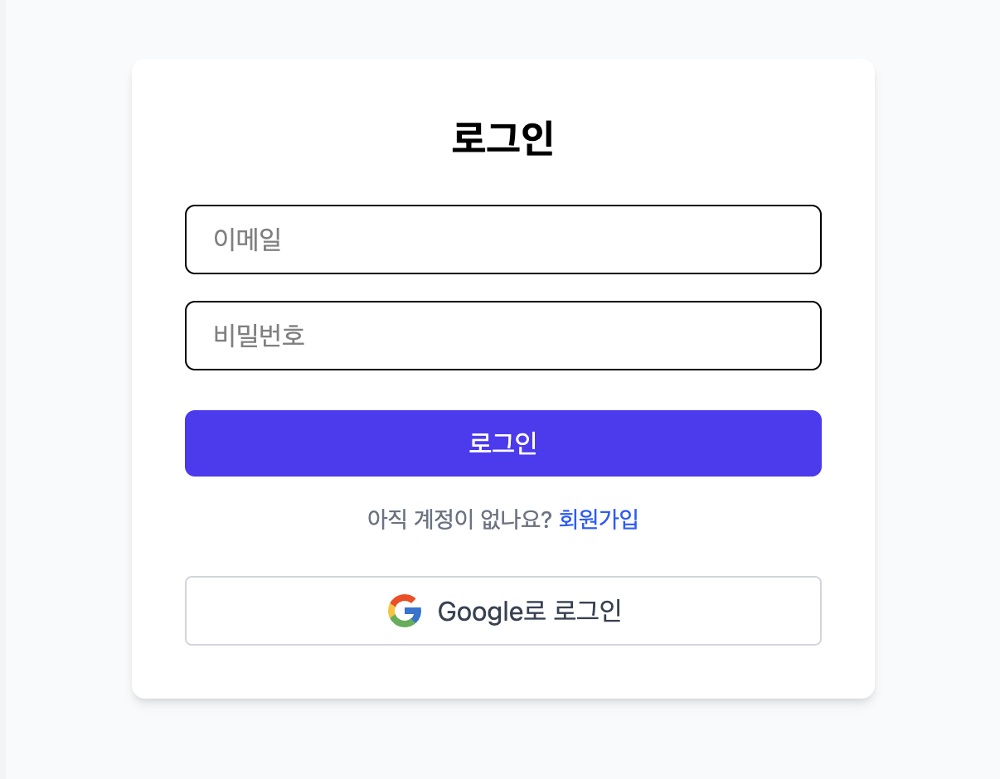

# Login System (Fullstack)

이 프로젝트는 간편한 **이메일 회원가입/로그인**과 **구글 OAuth 로그인**을 모두 지원하는 Vue + Node.js 기반 인증 시스템입니다.

👉 [DEMO](https://main.d2vnv368tnvtm1.amplifyapp.com/)



## ✨ 주요 기능

### 🗝️ 인증 & 회원 관리

- **회원가입**
  - 이메일 & 비밀번호 가입
  - 중복 이메일 체크
  - 비밀번호 해시(bcrypt)
- **로그인**
  - JWT 발급
  - Google OAuth 로그인 (팝업)
  - 최초 로그인 시 자동 회원가입
- **로그아웃**
  - Pinia 상태 초기화
  - 로컬스토리지 토큰 삭제

### 👤 유저 정보 관리

사용자가 직접 자신의 프로필과 계정 정보를 안전하게 수정

- **프로필 조회**
  - 로그인된 사용자 정보(ID, 이메일, 이름, 프로필 이미지)
- **이메일 수정**
  - 사용자 이메일 변경
  - 변경 시 중복 이메일 검사
- **이름 수정**
  - 사용자 이름 변경 가능
- **비밀번호 변경**
  - 현재 비밀번호 확인 후 새 비밀번호로 변경
  - bcrypt 해시 처리
- **프로필 이미지 관리**

  - 이미지 업로드 & 변경
  - DB에는 파일 경로만 저장
  - 즉시 변경 반영

### 🛠️ 관리자 페이지

권한이 admin인 사용자만 접근 가능한 페이지로, 모든 사용자 정보를 조회/수정/삭제할 수 있습니다.

- **사용자 목록 조회**
- **이름/권한 수정**
- **계정 삭제**
- **검색 기능**
- **API는 관리자 권한 확인 후 응답**

### 🔒 보안 및 인증

안전한 JWT 기반 인증과 보안 강화를 위한 다양한 보호 로직 제공

- **JWT 인증**
  - 모든 보호된 API는 JWT 필요
- **라우터 가드**
  - 인증 상태 없으면 페이지 접근 차단
- **토큰 갱신**
  - 새로고침 시 로컬 토큰으로 인증 복원 (verifyCertificate)
- **CORS & Same-Origin Policy 대응**
  - 안전한 도메인 정책 처리
- **OAuth 팝업 보안**
  - 부모창 postMessage 처리 시 origin 검사로 위조 방지

## ⚙️ 기술 스택

- **Frontend**: Vue 3, Vite, Pinia, TypeScript, Tailwind CSS
- **Backend**: Node.js, Express, PM2(Node.js 서버 유지)
- **Database**: MySQL
- **Storage**: AWS S3 Bucket (프로필 이미지 관리)
- **OAuth**: Google OAuth2 API
- **Deployment**: AWS EC2 (Backend), AWS Amplify (Frontend), AWS RDS (DB)
- **Security & Proxy**: Let’s Encrypt SSL, AWS Certificate Manager, Nginx Reverse Proxy (SSL & 포트 관리)
- **Containerization**: Docker, Docker Compose

## 프로젝트 구조

기능별 모듈화 + 관심사 분리

```bash
login-system/
├── backend/
│   ├── src/
│   │   ├── controllers/                 # 클라이언트 요청에 대한 로직
│   │   │   ├── auth.controller.ts       # 인증 관련 로직 처리
│   │   │   ├── user.controller.ts       # 일반 사용자 기능 처리
│   │   │   └── admin.controller.ts      # 어드민 기능 처리
│   │   ├── routes/                      # URL 경로와 컨트롤러 연결 라우터
│   │   │   ├── auth.routes.ts
│   │   │   ├── user.routes.ts
│   │   │   └── admin.routes.ts
│   │   ├── middlewares/                 # 중간 처리 로직
│   │   │   ├── authMiddleware.ts        # JWT 인증 미들웨어
│   │   │   └── checkAdmin.ts            # 관리자 권한 체크 미들웨어
│   │   ├── db/
│   │   │   ├── index.ts                 # MySQL 연결 풀
│   │   │   ├── seed.sql                 # 초기 샘플 데이터
│   │   │   └── schema.sql               # DB 스키마 정의
│   │   ├── types/                       # 타입 정의
│   │   ├── utils/
│   │   │   ├── jwt.ts                   # JWT 발급/검증 유틸리티
│   │   │   └── s3.ts                    # S3 연결 설정
│   │   ├── app.ts                       # Express 앱 설정
│   │   └── index.ts                     # 서버 실행 진입점
│   ├── tsconfig.json
│   ├── package.json
│   └── ...
│
├── client/
│   ├── src/
│   │   ├── components/                  # UI 컴포넌트
│   │   ├── router/                      # Vue Router 설정
│   │   ├── stores/                      # 전역 스토어
│   │   ├── views/                       # 페이지 단위 컴포넌트
│   │   ├── App.vue                      # 루트 컴포넌트
│   │   ├── main.ts                      # 진입점
│   │   └── style.css                    # 전역 스타일
│   ├── index.html
│   ├── vite.config.ts
│   ├── tsconfig.json
│   ├── package.json
│   └── ...
```

## 🗂️ DB 설계 전략

단일 테이블로 간결하게 관리하면서도, 인증/보안을 위해 필요한 제약조건과 해시화 설계를 철저히 적용

### 1. 정규화 (Normalization) 기본 준수

- 사용자 데이터는 users 테이블 하나로 관리
- 중복 데이터 없이 ID(PK) 기반으로 유일성 보장
- 이메일은 UNIQUE 인덱스 설정 → 중복 회원가입 방지

### 2. 보안 데이터 분리

- 비밀번호는 절대 평문 저장 X
- bcrypt 해시된 값만 저장
- 토큰은 DB에 저장하지 않고 클라이언트와 서버에서 JWT로만 검증 → Stateless 인증

### 3. 필요한 필드만 최소화

- 로그인/프로필에 필요한 필드만 설계 (id, email, name, password, profile_image)
- 불필요한 컬럼 없이 가볍고 유지보수 용이

### 4. 유연한 확장성 고려

- 프로필 이미지 경로만 저장 → 실제 파일은 서버 디렉토리나 S3 등 외부 저장소 사용 가능
- OAuth 사용자도 같은 users 테이블에 통합 관리 (social provider 정보 컬럼 추가 가능)

### 5. 기본 인덱스와 제약조건

- PK: id (AUTO_INCREMENT)
- UNIQUE: email
- NOT NULL 제약조건으로 무결성 보장

## 🐳 로컬 개발 환경 (Docker)

로컬에서도 프로덕션과 동일한 환경을 간편하게 실행할 수 있도록 **Docker**와 `docker-compose`를 사용합니다.

### 📦 포함된 서비스

- `client`: Vue 3 프론트엔드
- `backend`: Node.js Express 백엔드
- `db`: MySQL 데이터베이스

### 📂 공유되는 파일

- `Dockerfile` (각 서비스별 빌드 정의)
- `docker-compose.yml` (모든 서비스 한번에 관리)
- `schema.sql` (DB 스키마)
- `seed.sql` (초기 데이터)
- `.env.development.example` (환경 변수 예시)

### ⚡️ 실행 방법

1. 레포지토리 클론

   ```bash
   git clone https://github.com/fromnowwon/login-system.git
   cd login-system
   ```

2. 환경 변수 파일 작성

   ```bash
    # Backend
    cd backend
    cp .env.development.example .env.development

    # Client
    cd ../client
    cp .env.development.example .env.development
   ```

3. Docker 이미지 빌드 및 컨테이너 실행

   ```bash
   # 프로젝트 루트에서
   docker-compose up --build
   ```

## ⚙️ 개발 과정 전체 요약 (Step-by-Step)

### 0. Docker로 로컬 환경 일원화

- 개발 중 MySQL, 백엔드, 프론트를 각각 따로 실행하는 번거로움을 줄이기 위해 Dockerfile과 docker-compose.yml로 통합 개발 환경 구축.
- docker-compose 한 번 실행으로 모든 서비스 컨테이너 동시 구동.
- 로컬에서도 배포 환경과 거의 동일한 네트워크 & DB 설정으로 테스트 가능.

### 1. 프로젝트 초기 세팅

- Node.js Express 서버 & Vue 3 Vite 프론트엔드 생성
- ESLint, TypeScript, Pinia 스토어 세팅
- GitHub 레포 연결
- Dockerfile, docker-compose.yml 작성 → 환경 일관성 보장
- CORS, .env 관리

### 2. Backend API 개발

- auth.controller.ts : 회원가입, 로그인, JWT 발급
- user.controller.ts : 사용자 정보 조회/수정, 비밀번호 변경, 프로필 이미지 처리
- JWT 인증 미들웨어로 보호된 API 구현
- DB(MySQL) 테이블 & 스키마 작성, 연결 풀 구성

### 3. Frontend 기능 개발

- Pinia 스토어로 authStore 설계 (토큰 & 사용자 상태)
- Vue Router & 라우터 가드 설정: 인증 상태에 따라 페이지 이동 제한
- 로그인/회원가입/마이페이지/프로필 편집 뷰 작성
- Tailwind CSS로 반응형 UI 구현

### 4. Google OAuth 연동

- Google API Console에 앱 등록 & OAuth Client ID 발급
- 팝업 방식 OAuth 처리 구현 (팝업에서 인증 → 부모창으로 토큰 전달)
- postMessage와 origin 검사로 보안 강화
- 팝업 방식 & 리디렉션 방식 모두 테스트

### 5. 문제 해결 및 디버깅

#### 🐞 Google OAuth 팝업 → 부모창 메시지 전달 안 됨

- 문제: 팝업이 window.opener.postMessage를 호출은 하지만, 부모창에서 origin mismatch로 메시지를 무시
- 원인: 팝업(구글 로그인)과 부모창(앱 도메인)이 서로 다른 출처(origin)이기 때문
- 해결: 팝업에서 window.opener.postMessage 사용 → 부모창에서 origin을 VITE_CLIENT_URL로 정확히 맞춤

  ```javaScript
  // 부모 창
  function handleMessage(event: MessageEvent) {
    // ✅ origin 검사!
    // event.origin을 신뢰할 수 있는 도메인(VITE_CLIENT_URL)으로 제한
    if (event.origin !== import.meta.env.VITE_CLIENT_URL) return;

    if (event.data.type === "google-login-success") {
      // origin 검사가 없으면 무조건 실행됨
      // origin이 달라지면 메시지를 무시하거나, 보안 위험
      const token = event.data.token;
      authStore.token = token;
      localStorage.setItem("token", token);
      authStore.verifyCertificate();
      window.location.href = "/";
    }
  }
  ```

#### 🐞 라우터 가드 리다이렉트 무한 반복

- 문제: 라우터 가드에서 토큰 확인 + 인증 복원 + 리다이렉트 조건이 꼬여서 /login → / → /login 무한루프 발생. 인증 복원이 await 되기 전에 리다이렉트 조건이 실행됨
- 해결: verifyCertificate를 반드시 await 해서 인증 복원이 완료된 후에 다음 조건 실행.

  ```javaScript
    router.beforeEach(async (to, from, next) => {
      const authStore = useAuthStore();

      // 수정 전: verifyCertificate()를 await 하지 않음
      // if (authStore.token && !authStore.user) {
      //  authStore.verifyCertificate();
      // }

      // ✅ 수정 후: 반드시 await!
      if (authStore.token && !authStore.user) {
        await authStore.verifyCertificate();
      }

      // ✅ 그리고 바로 다음 조건 실행
      if (
        (to.path === "/login" || to.path === "/register") &&
        authStore.token &&
        authStore.user
      ) {
        return next("/");
      }

      if (
        !authStore.token &&
        !["/login", "/register"].includes(to.path)
      ) {
        return next("/login");
      }

      next();
    });
  ```

#### 🐞 EC2, RDS, Amplify 배포 시 CORS & 환경변수 문제

- 문제: 백엔드(EC2)와 DB(RDS), 프론트(Amplify)가 서로 다른 도메인으로 배포됨 → CORS 에러 발생

  환경변수(VITE_API_URL, VITE_CLIENT_URL, GOOGLE_CLIENT_ID) 설정 불일치로 API 요청 실패

- 해결

  **백엔드**

  - CORS 설정에서 origin에 Amplify 도메인과 로컬 모두 허용.
  - .env로 CLIENT_URL 관리.

### 6. 배포 & 운영

- Docker: 로컬 개발 컨테이너화로 개발자별 환경차 제거
- EC2: Node.js 백엔드 서버 배포
- Amplify: 프론트엔드 CI/CD 배포
- RDS: MySQL DB 관리
- Nginx Reverse Proxy + SSL 적용
- Certbot 자동 갱신

## ✅ 최종 결과

- 로컬 개발환경 Docker로 통합
- 이메일/비밀번호 회원가입 & 로그인
- Google OAuth2 로그인
- 사용자 정보 CRUD (이메일/이름/비밀번호/프로필 이미지)
- JWT 인증 & 라우터 가드
- AWS 풀스택 배포 (EC2, RDS, Amplify)
- 모바일 반응형 지원

## 👤 Author

- GitHub: [Chaewon](https://github.com/fromnowwon)
